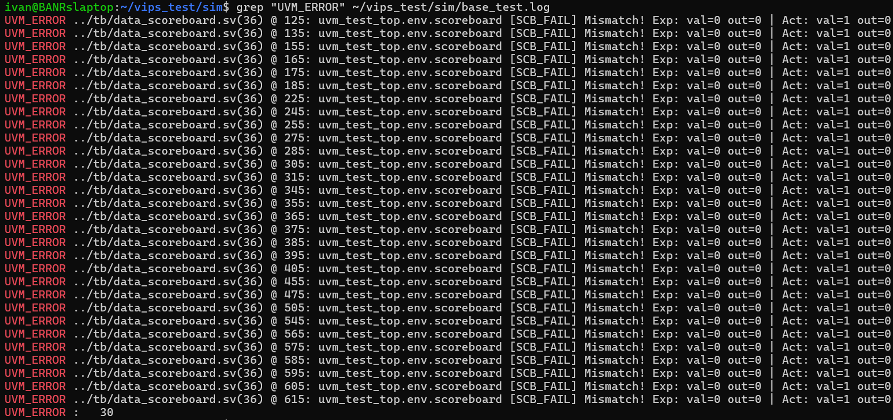
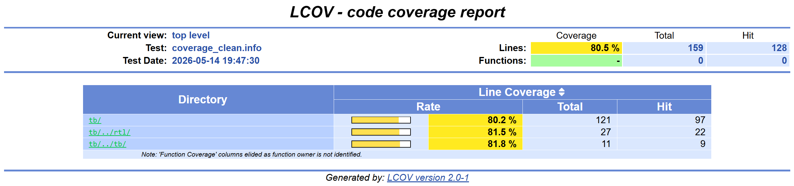

# Учебный проект: UVM-тестбенч для Data Comparator на Verilator

Это мой первый проект по настройке среды верификации **UVM** с нуля. В качестве симулятора используется бесплатный **Verilator** (версия 5.046). Цель проекта — протестировать модуль сравнения данных (`data_comparator`), автоматизировать поиск аппаратных ошибок и оценить покрытие.

## Структура проекта
* `rtl/` — Исходный код тестируемого модуля (DUT) (`data_comparator.sv`).
* `uvm/` — Исходники библиотеки UVM (порт от Chips Alliance для совместимости с Verilator).
* `tb/` — Файлы тестбенча:
  * `data_comparator_if.sv` — Интерфейс подключения к модулю.
  * `data_item.sv` — Пакет данных (транзакция), который мы генерируем.
  * `data_agent.sv` — Агент (Драйвер для подачи сигналов и Монитор для их отслеживания).
  * `data_scoreboard.sv` — Модель проверки (предсказывает правильный ответ и сравнивает с реальным).
  * `tb_top.sv` — Главный файл тестбенча.
* `sim/` — Скрипты и `Makefile` для удобного запуска.
* `report/` — Готовые логи прохождения тестов и сгенерированный HTML-отчет о покрытии кода (для удобной проверки без компиляции).

## Что было реализовано
- **Автоматизация:** Процессы сборки, тестирования и генерации отчетов запускаются консольными командами (`make`).
- **Поиск ошибок:** Scoreboard успешно выявляет аппаратную ошибку в логике конвейера.
- **Кодовое покрытие (Code Coverage):** Настроен сбор статистики и генерация HTML-отчета через утилиту `lcov` (системные файлы UVM отфильтрованы для чистоты отчета).
- **Функциональное покрытие (Functional Coverage):** В коде монитора реализована структура `covergroup` для отслеживания сценариев данных. *Примечание: из-за текущих ограничений симулятора Verilator конструкции covergroup игнорируются при компиляции (предупреждения COVERIGN), однако код добавлен для демонстрации владения методологией.*

## Процесс верификации: Этапы работы

### Этап 1: Обнаружение ошибки
Исходный код RTL в репозитории намеренно оставлен в изначальном состоянии. При первом запуске тестбенч сразу обнаруживает несоответствие данных: модуль `data_comparator` продолжает выдавать признак «валидности» даже тогда, когда на вход ничего не поступает.

**Ошибки в логе (Mismatch):**


### Этап 2: Исправление RTL и финальная проверка
Причиной ошибки было отсутствие веток `else` в сдвиговых регистрах: значения конвейера сдвигались и перезаписывались некорректно при `valid_i = 0`. В код была добавлена логика обнуления внутренних регистров при отсутствии новых данных. После пересборки все тесты прошли без ошибок.

**Финальный лог (0 ошибок):**
```text
--- UVM Report Summary ---
** Report counts by severity
UVM_INFO :    4
UVM_WARNING :   24
UVM_ERROR :    0
UVM_FATAL :    0
```
**Анализ покрытия (Code Coverage):**
После исправления логики метрика покрытия стабильно держится на уровне ~80%. Это подтверждает, что тестбенч успешно генерирует базовые сценарии (как непрерывный поток данных, так и паузы с `valid_i = 0`). Оставшиеся проценты естественны для случайной генерации на данном этапе и приходятся на переключения отдельных битов на шинах данных и краевые условия.



## Запуск проекта

Все действия по сборке и запуску выполняются из директории со скриптами. Перейдите в неё перед началом работы:
```bash
cd sim/
```

1. **Компиляция проекта:** `make build`
2. **Запуск тестов:** `make run_regression`
3. **Сбор статистики покрытия:** `make coverage`

*Примечание: после внесения изменений в RTL или файлы тестбенча рекомендуется выполнить `make clean` перед повторной сборкой.*

## Просмотр отчета о покрытии (HTML)

Для удобства готовые текстовые логи и сгенерированный HTML-отчет о покрытии уже добавлены в репозиторий в папку `report/`. 

Поскольку GitHub не отображает HTML-сайты напрямую из кода, есть два варианта для просмотра отчета:

**Вариант 1: Посмотреть готовый (без компиляции)**
1. Скачайте репозиторий себе на компьютер.
2. Зайти в распакованную папку `report/coverage_html`.
3. Открыть файл `index.html`.

**Вариант 2: Сгенерировать самостоятельно**
Если вы хотите запустить тесты и собрать статистику на своей машине:
1. Перейдите в терминале в папку `sim/` и выполните `make coverage`
2. Утилита создаст новую папку `coverage_html` внутри `sim/`.
3. Откройте файл `sim/coverage_html/index.html` в браузере.
